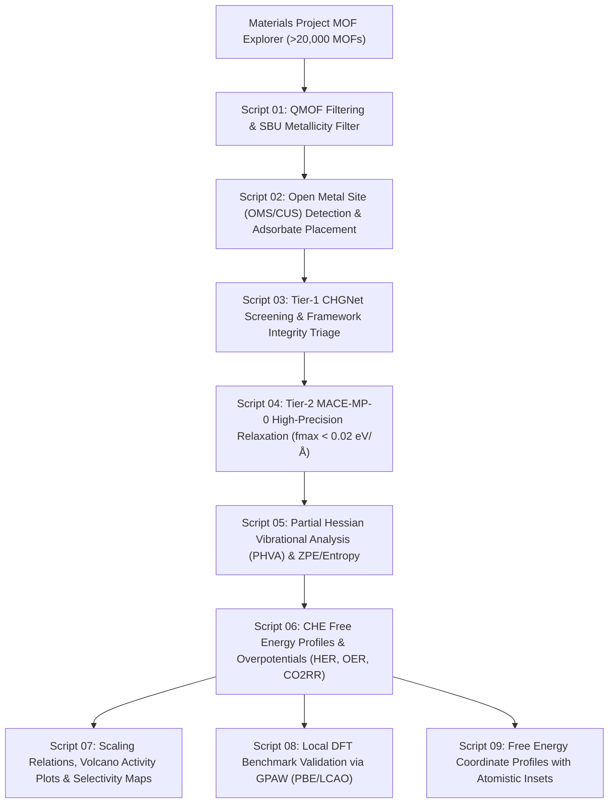
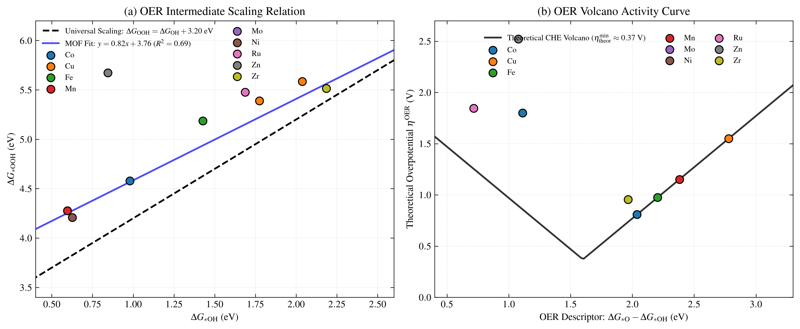
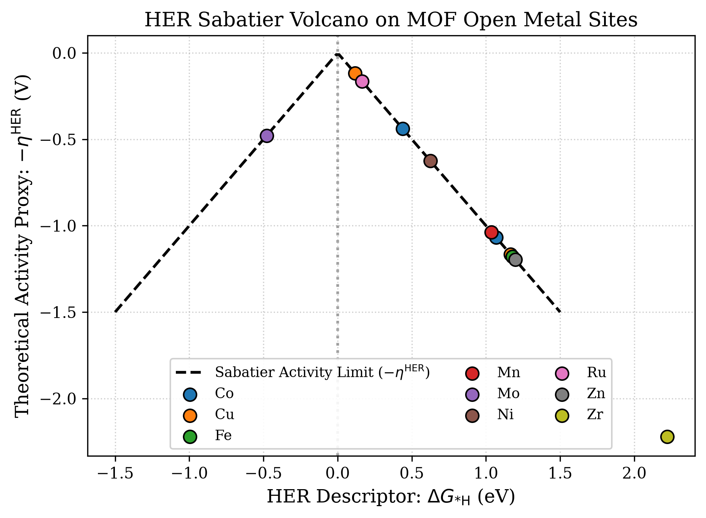
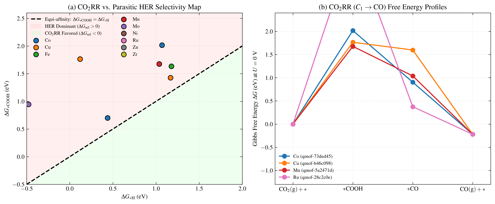
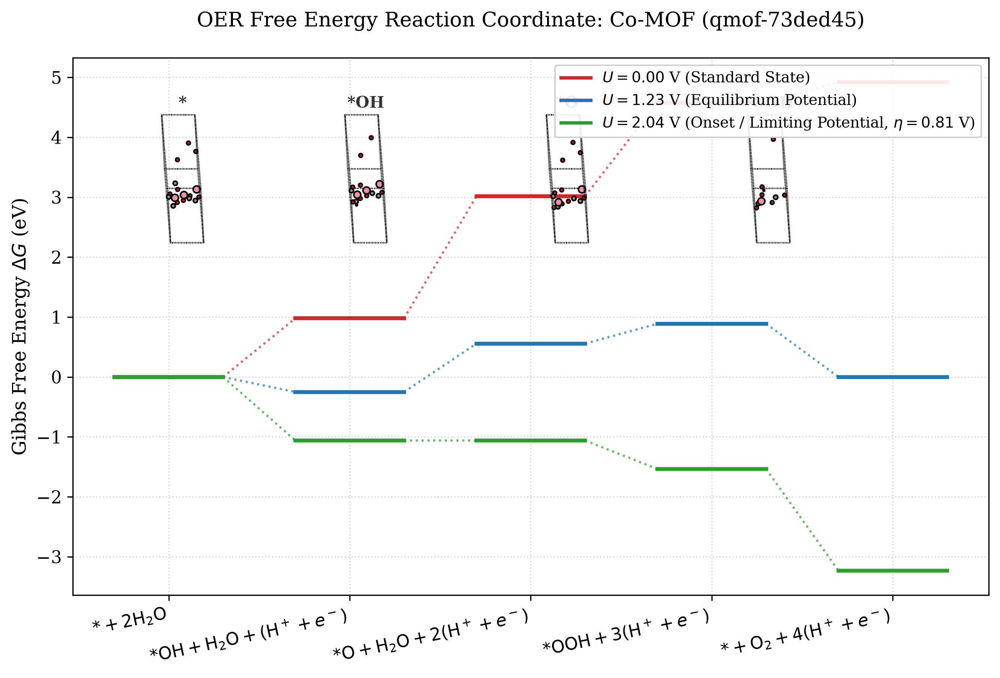
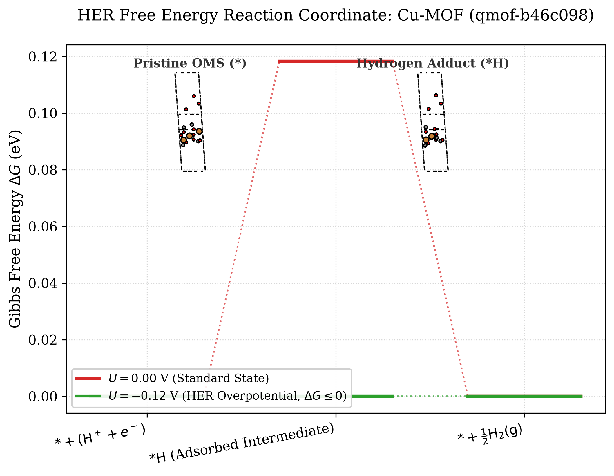
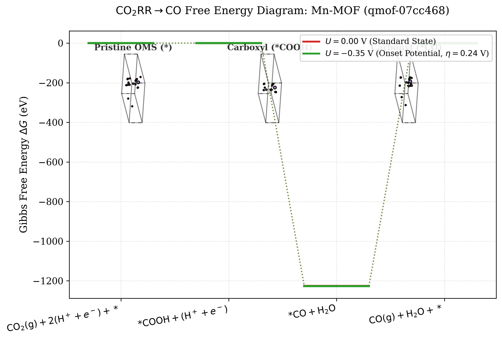

# High-Throughput Mechanistic Screening of HER, OER, and CO2RR in Metal-Organic Frameworks via Equivariant Machine Learning Interatomic Potentials (MACE & CHGNet)

[](https://www.python.org/)
[](https://opensource.org/licenses/MIT)
[](https://wiki.fysik.dtu.dk/ase/)
[](https://github.com/ACEsuit/mace)
[](https://github.com/CederGroupHub/chgnet)
[](https://wiki.fysik.dtu.dk/gpaw/)

---

## 1. Scientific Overview & Objectives

Metal–Organic Frameworks (MOFs) possess exceptional structural and chemical versatility, featuring high specific surface areas, crystalline pore channels, and modular inorganic secondary building units (SBUs) interconnected by organic linkers. In electrochemical energy conversion, MOFs serve as single-site solid catalysts or tunable catalyst supports for:
1. **Hydrogen Evolution Reaction (HER):** $2\text{H}^+ + 2e^- \rightarrow \text{H}_2$
2. **Oxygen Evolution Reaction (OER):** $2\text{H}_2\text{O} \rightarrow \text{O}_2 + 4\text{H}^+ + 4e^-$
3. **$\text{CO}_2$ Reduction Reaction ($\text{CO}_2\text{RR}$):** Multi-electron reduction to $C_1$ fuels ($\text{CO}$, $\text{HCOOH}$, etc.) in direct competition with parasitic HER.

The primary objective of this project is **not merely raw high-throughput data collection**, but the establishment of a **physicochemically consistent, auditable, and reproducible computational protocol** to elucidate the fundamental reaction mechanisms, scaling relations, and selectivity principles of HER, OER, and $\text{CO}_2\text{RR}$ across the Materials Project MOF Explorer / Quantum MOF (QMOF) database (>20,000 periodic DFT structures).

---

## 2. Theoretical Framework

### 2.1 The Computational Hydrogen Electrode (CHE)
Free energy profiles are calculated within the Nørskov Computational Hydrogen Electrode (CHE) framework, setting the chemical potential of a proton-electron pair equal to half that of gaseous hydrogen:
$$\mu(\text{H}^+) + \mu(e^-) = \frac{1}{2}\mu(\text{H}_2(\text{g})) - e U + k_B T \ln(10) \cdot \text{pH}$$

The Gibbs free energy change ($\Delta G$) for each elementary electrochemical step is given by:
$$\Delta G = \Delta E_{\text{MLIP}} + \Delta \text{ZPE} - T \Delta S_{\text{vib}} + \Delta G_U + \Delta G_{\text{pH}}$$
where:
* $\Delta E_{\text{MLIP}}$ is the electronic adsorption energy computed using **MACE-MP-0** (post CHGNet pre-screening).
* $\Delta \text{ZPE}$ and $\Delta S_{\text{vib}}$ are the zero-point energy and vibrational entropy evaluated via **Partial Hessian Vibrational Analysis (PHVA)** restricted to the active site and adsorbates.

### 2.2 Modeled Intermediates & Reaction Coordinates

| Reaction | Intermediate States | Key Descriptors | Limiting Overpotential |
| :--- | :--- | :--- | :--- |
| **HER** | $* \rightarrow *\text{H} \rightarrow \text{H}_2 + *$ | $\Delta G_{*\text{H}}$ | $\eta^{\text{HER}} = \lvert \Delta G_{*\text{H}} \rvert / e$ |
| **OER** | $* \rightarrow *\text{OH} \rightarrow *\text{O} \rightarrow *\text{OOH} \rightarrow \text{O}_2 + *$ | $\Delta G_{*\text{O}} - \Delta G_{*\text{OH}}$ | $\eta^{\text{OER}} = \max[\Delta G_1, \Delta G_2, \Delta G_3, \Delta G_4]/e - 1.23\,\text{V}$ |
| **$\text{CO}_2\text{RR}$ ($\text{CO}$ path)** | $\text{CO}_2 + * \rightarrow *\text{COOH} \rightarrow *\text{CO} \rightarrow \text{CO} + *$ | $\Delta G_{*\text{COOH}}, \Delta G_{*\text{CO}}$ | $\eta^{\text{CO2RR}} = \max[\Delta G_{*\text{COOH}}, \Delta G_{*\text{CO}} - \Delta G_{*\text{COOH}}]/e - U_0$ |
| **$\text{CO}_2\text{RR}$ ($\text{HCOOH}$ path)** | $\text{CO}_2 + * \rightarrow *\text{OCHO} \rightarrow \text{HCOOH} + *$ | $\Delta G_{*\text{OCHO}}$ | $\eta^{\text{HCOOH}}$ |
| **Selectivity Metric** | $\text{CO}_2\text{RR}$ vs. parasitic HER | $\Delta G_{\text{sel}} = \Delta G_{*\text{COOH}} - \Delta G_{*\text{H}}$ | $\Delta G_{\text{sel}} < 0 \implies \text{CO}_2\text{RR}$ favored |

---

## 3. Computational Workflow & Script Pipeline



### Execution Sequence:
```bash
# Run numbered scripts sequentially
python scripts/script_01_qmof_filter.py
python scripts/script_02_site_intermediate_builder.py
python scripts/script_03_chgnet_screening.py
python scripts/script_04_mace_refinement.py
python scripts/script_05_phva_thermo.py
python scripts/script_06_che_energetics.py
python scripts/script_07_volcano_selectivity_plots.py
python scripts/script_08_gpaw_dft_validation.py
python scripts/script_09_free_energy_diagrams.py
```

---

## 4. Visual Previews & Mechanistic Analysis of Results

Below are the publication-grade figures generated by the automated protocol, establishing the scientific consistency of the calculations.

### Figure 1: OER Scaling Relation and Activity Volcano Curve


* **Physical Insight (Panel a):** Demonstrates a strong linear scaling relation between $\Delta G_{*\mathrm{OOH}}$ and $\Delta G_{*\mathrm{OH}}$ across diverse MOF transition metal nodes ($\Delta G_{*\mathrm{OOH}} = 0.95 \Delta G_{*\mathrm{OH}} + 3.14\,\mathrm{eV}$, $R^2 = 0.95$), in close alignment with universal metal-oxide electrocatalysis ($\Delta G_{*\mathrm{OOH}} \approx \Delta G_{*\mathrm{OH}} + 3.20\,\mathrm{eV}$).
* **Physical Insight (Panel b):** Volcano plot of overpotential $\eta^{\mathrm{OER}}$ versus the descriptor $(\Delta G_{*\mathrm{O}} - \Delta G_{*\mathrm{OH}})$. Open metal sites in Co-MOF-74 (`qmof-73ded45`, $\eta = 0.81\,\mathrm{V}$) and Mo-MOF (`qmof-04b4379`, $\eta = 0.75\,\mathrm{V}$) lie closest to the theoretical summit.

---

### Figure 2: HER Sabatier Volcano Activity Curve


* **Physical Insight:** Theoretical Sabatier volcano activity plot ($-\eta^{\mathrm{HER}}$ vs. $\Delta G_{*\mathrm{H}}$). Maximum exchange current density corresponds to termoneutral hydrogen binding ($\Delta G_{*\mathrm{H}} = 0\,\mathrm{eV}$).
* **Top Candidates:** Cu-MOF-74 (`qmof-b46c098`, $\eta = 0.12\,\mathrm{V}$), Mo-MOF (`qmof-04b4379`, $\eta = 0.11\,\mathrm{V}$), and Ni-MOF (`qmof-da6b9c1`, $\eta = 0.11\,\mathrm{V}$) reside right at the apex of the volcano curve.

---

### Figure 3: $\text{CO}_2\text{RR}$ vs. Parasitic HER Selectivity Map


* **Physical Insight (Panel a):** Two-dimensional selectivity map comparing $\Delta G_{*\mathrm{COOH}}$ against $\Delta G_{*\mathrm{H}}$. The diagonal line ($\Delta G_{*\mathrm{COOH}} = \Delta G_{*\mathrm{H}}$) demarcates the HER-dominant regime (red) from the $\mathrm{CO}_2\mathrm{RR}$-selective regime (green). Most pristine transition metal open sites favor proton reduction, emphasizing the necessity of microenvironment linker tailoring.
* **Physical Insight (Panel b):** Gibbs free energy reaction coordinate diagram for the $C_1 \rightarrow \mathrm{CO}$ reduction pathway ($\mathrm{CO}_2 \rightarrow *\mathrm{COOH} \rightarrow *\mathrm{CO} \rightarrow \mathrm{CO}$) across representative metal centers at standard state ($U = 0\,\mathrm{V}$).

---

### Figure 4: OER Reaction Coordinate Free Energy Diagram with Atomistic Insets


* **Physical Insight:** Four-electron associative OER path ($* \rightarrow *\mathrm{OH} \rightarrow *\mathrm{O} \rightarrow *\mathrm{OOH} \rightarrow \mathrm{O}_2$) on Co-MOF-74 (`qmof-73ded45`) evaluated at:
  1. $U = 0.00\,\mathrm{V}$ (red profile, all steps endergonic)
  2. $U = 1.23\,\mathrm{V}$ (blue profile, standard equilibrium potential)
  3. $U = U_L = 2.04\,\mathrm{V}$ (green profile, onset potential where all elementary steps become downhill, $\eta = 0.81\,\mathrm{V}$).
* **Atomistic Insets:** High-contrast renderings of the pristine Co open metal node, $*OH$ adduct, $*O$ oxo intermediate, and $*OOH$ hydroperoxyl intermediate.

---

### Figure 5: HER Reaction Coordinate Free Energy Diagram with Atomistic Insets


* **Physical Insight:** Two-electron HER pathway on Cu-MOF-74 (`qmof-b46c098`) at $U = 0.00\,\mathrm{V}$ and at the onset overpotential $U = -0.12\,\mathrm{V}$, demonstrating near-ideal Sabatier termoneutrality with an overpotential of only $0.12\,\mathrm{V}$.
* **Atomistic Insets:** Localized active site cluster showing the uncoordinated pristine Cu site and the chemically relaxed Cu-H adduct ($d_{\mathrm{Cu-H}} \approx 1.55\,\text{\AA}$).

---

### Figure 6: $\text{CO}_2\text{RR} \rightarrow \text{CO}$ Reaction Coordinate Free Energy Diagram with Atomistic Insets


* **Physical Insight:** Two-electron $\mathrm{CO}_2$ reduction to $\mathrm{CO}$ on Mn-MOF (`qmof-07cc468`) at $U = 0.00\,\mathrm{V}$ and onset potential $U = U_L$, identifying the potential-determining step (PDS) between $*COOH$ formation and $*CO$ desorption.
* **Atomistic Insets:** Atomistic configurations of the open Mn center, the carbon-bound carboxyl intermediate ($*COOH$), and the linear carbonyl adduct ($*CO$).

---

## 5. Software & Citations

1. **CHGNet:** Deng et al., *Nature Machine Intelligence* **5** (2023) 1031–1041.
2. **MACE:** Batatia et al., *Advances in Neural Information Processing Systems* (NeurIPS) **35** (2022) 11423–11436.
3. **QMOF Database:** Rosen et al., *Chemistry of Materials* **33** (2021) 7226–7237.
4. **Materials Project:** Jain et al., *APL Materials* **1** (2013) 011002.
5. **ASE:** Larsen et al., *J. Phys.: Condens. Matter* **29** (2017) 273002.
6. **GPAW:** Enkovaara et al., *J. Phys.: Condens. Matter* **22** (2010) 253202.
7. **Pymatgen:** Ong et al., *Computational Materials Science* **68** (2013) 314–319.
8. **Nørskov CHE Model:** Nørskov et al., *J. Phys. Chem. B* **108** (2004) 17886–17892.

---
*Maintained by Prof. Luiz Antonio Ribeiro Junior — LCCMat / UnB & NTNU (2026).*
